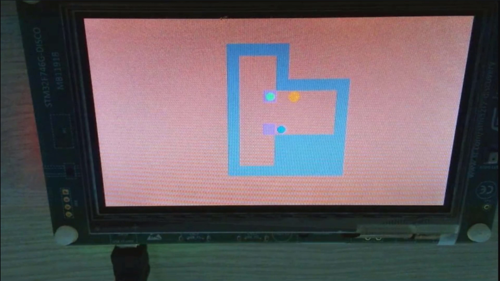
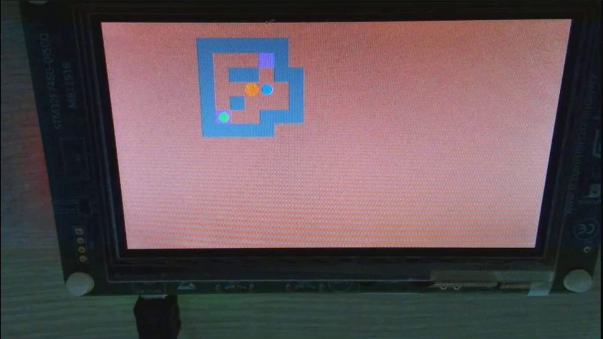
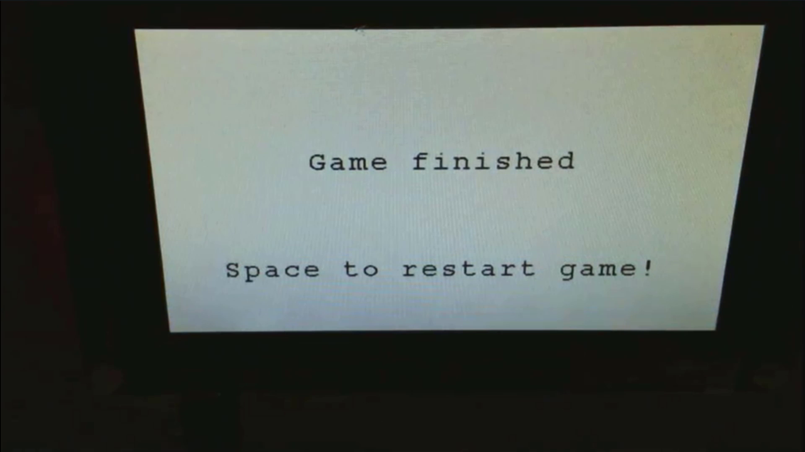

# Sokoban game for STM32F746G-DISCO

Simple [Sokoban](https://en.wikipedia.org/wiki/Sokoban) port on STM32F746G-DISCO device with 480x272 LCD touch panel (but due to remote classes, the control was done with buttons).

Presentation:
[YouTube](https://www.youtube.com/watch?v=PWS85KKeUfU)

Main logic is located in following files:
* [main.c](./Src/main.c#L1576) (`StartDefaultTask` function)
* [sokoban.c](./Src/sokoban.c)
* [sokoban.h](./Inc/sokoban.h)

Game logic is really simple and whole game has ~300 lines of code. \
Possible improvements:
* usage of background layer to draw borders/empty space
* now every player action requires redrawing whole screen - it would be better to draw only changed elements

A couple of screenshots:

